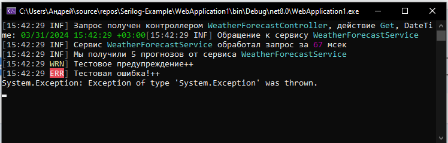

# Serilog_Example

В этом решении показано, как правильно пользоваться логгером в проектах различного типа,
оперируя абстракциями, определёнными в составе сборки `Microsoft.Extensions.Logging.Abstractions`,
при этом "под капотом" используя реализацию от `Serilog`.

В каждом проекте находится свой собственный файл `readme.md` с подробной информацией о проекте.

Перед запуском проектов данного решения обязательно установите на своём локальном компьютере
приложение [Seq](https://datalust.co/seq) - оно предоставляет удобный Web-интерфейс для работы
со структурированным логом (приложения данного решения будут писать логи в т.ч. и в **Seq**).

Каждый проект пишет логи сразу в несколько приёмников:

  * Вывод в консоль
  * Вывод в файл. Например, в проекте **WebApplication1** показано, как настраивать _пользовательский_
	формат сообщений, сохраняемых в файл, а в проектах **WorkerService1** и **ConsoleApp1** показано,
	как сохранять в файле сообщения в компактном JSON-формате.
  * Запись в журнал Windows
  * Отправка структурированного лога в локальный [Seq](https://datalust.co/seq) - этот лог можно
	просматривать в браузере по адресу <http://localhost:5341/#/events>. Присутствует гибкая возможость
	фильтрации, сортировки и т.п.

Если в любом из проектов данного решения (за исключением **ConsoleApp1**) закомментировать строку кода,
регистрирующую `Serilog` (эта строка будет разной, в зависимости от типа проекта), то по умолчанию будет
работать реализация от Microsoft. Эта реализация будет писать логи только в консоль и в журнал Windows.

## Проекты в составе решения

  * **WebApplication1** - Web-сервис. Приложение создано на основе шаблона `ASP.NET Core Web API`. Платформа: `.NET 8`.
  * **WorkerService1** - Worker-сервис. Приложение создано на основе шаблона `Worker Service`. Платформа: `.NET 8`.
  * **ConsoleApp1** - Консольное приложение, созданное на основе шаблона `Console Application`. Платформа: `.Net Framework 4.6.2`. Эта
    старая версия задействована автором потому, что её используют плагины **Dynamics 365 CRM**. Т.о. для разработчика создать по
	аналогии проект для `.Net Framework 4.8` не должно составить труда.

## Примеры лога, полученного при работе приложения WebApplication1

Файл `log20240331.txt`, содержимое которого формировалось на основе указанного нами пользовательского шаблона записи:

```
2024-03-31 15:42:29.368 +03:00 [INF] | BUSH-DESKTOP | Logging Scopes | Андрей | 0HN2HG01M1EJB:00000004 | Приложение работает из под учётной записи Андрей|
2024-03-31 15:42:29.398 +03:00 [INF] | BUSH-DESKTOP | Logging Scopes | Андрей | 0HN2HG01M1EJB:00000004 | Запрос получен контроллером WeatherForecastController, действие Get, DateTime: "2024-03-31T15:42:29.3985735+03:00"|
2024-03-31 15:42:29.403 +03:00 [INF] | BUSH-DESKTOP | Logging Scopes | Андрей | 0HN2HG01M1EJB:00000004 | Обращение к сервису WeatherForecastService|
2024-03-31 15:42:29.433 +03:00 [INF] | BUSH-DESKTOP | Logging Scopes | Андрей | 0HN2HG01M1EJB:00000004 | Сервис WeatherForecastService обработал запрос за 67 мсек|
2024-03-31 15:42:29.434 +03:00 [INF] | BUSH-DESKTOP | Logging Scopes | Андрей | 0HN2HG01M1EJB:00000004 | Мы получили 5 прогнозов от сервиса WeatherForecastService|
2024-03-31 15:42:29.435 +03:00 [WRN] | BUSH-DESKTOP | Logging Scopes | Андрей | 0HN2HG01M1EJB:00000004 | Тестовое предупреждение++|
2024-03-31 15:42:29.436 +03:00 [ERR] | BUSH-DESKTOP | Logging Scopes | Андрей | 0HN2HG01M1EJB:00000004 | Тестовая ошибка!++|
System.Exception: Exception of type 'System.Exception' was thrown.
```

Логи в **Seq**:


Консольный вывод:



Журнал Windows:


## Примеры компактного JSON-лога, сохраняемого в файл log20240331.json полученного при работе приложения WorkerService1

```
{"@t":"2024-03-31T12:57:00.2719321Z","@mt":" -> Воркер запущен в: {time}","time":"2024-03-31T15:57:00.2545694+03:00","SourceContext":"WorkerService1.Worker","MachineName":"BUSH-DESKTOP","UserName":"Андрей","Environment":"Development","AppName":"Logging Scopes"}
{"@t":"2024-03-31T12:57:00.3176476Z","@mt":" -> Некоторое тестовое предупреждение...","@l":"Warning","SourceContext":"WorkerService1.Worker","MachineName":"BUSH-DESKTOP","UserName":"Андрей","Environment":"Development","AppName":"Logging Scopes"}
{"@t":"2024-03-31T12:57:00.3193488Z","@mt":" -> Некоторое тестовое исключение...","@l":"Error","@x":"System.Exception: Шишкин лес","SourceContext":"WorkerService1.Worker","MachineName":"BUSH-DESKTOP","UserName":"Андрей","Environment":"Development","AppName":"Logging Scopes"}
{"@t":"2024-03-31T12:57:01.3354537Z","@mt":" -> Воркер запущен в: {time}","time":"2024-03-31T15:57:01.3353762+03:00","SourceContext":"WorkerService1.Worker","MachineName":"BUSH-DESKTOP","UserName":"Андрей","Environment":"Development","AppName":"Logging Scopes"}
{"@t":"2024-03-31T12:57:01.3372222Z","@mt":" -> Некоторое тестовое предупреждение...","@l":"Warning","SourceContext":"WorkerService1.Worker","MachineName":"BUSH-DESKTOP","UserName":"Андрей","Environment":"Development","AppName":"Logging Scopes"}
{"@t":"2024-03-31T12:57:01.3379233Z","@mt":" -> Некоторое тестовое исключение...","@l":"Error","@x":"System.Exception: Шишкин лес","SourceContext":"WorkerService1.Worker","MachineName":"BUSH-DESKTOP","UserName":"Андрей","Environment":"Development","AppName":"Logging Scopes"}
```